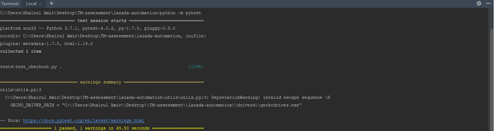

# lazada-automation
TM assessment Q1

### Steps:
1) Execute **install.bat** from installation folder
2) Amend util.py from utils folder by providing browser driver's path (example: gecko driver .exe)
3) Run command **python -m pytest**

### Example result:

### Limitation:
Not able to pass login mechanism as web request for slider action when running from automated browser

